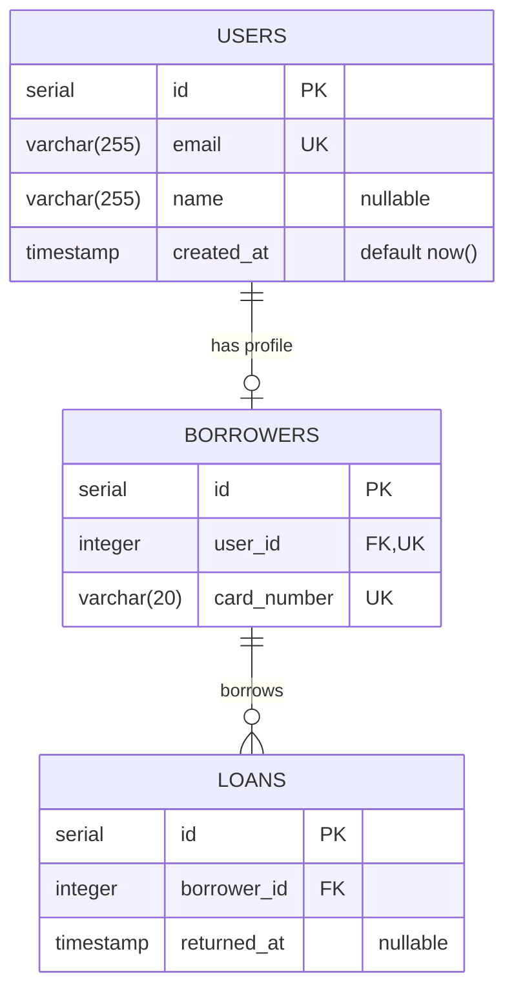

# ERD Generator

Turn domain requirements into a **verified** Mermaid ERD plus a rendered SVG. A diagram only counts as done when `render_erd.js` prints `SUCCESS`.

## Workflow

Follow these steps in order. All commands run from the **repository root**.

### 1. Parse the requirements

Extract:

- **Entities** (nouns that need their own table)
- **Primary keys (PK)** and **foreign keys (FK)** for each entity
- **Cardinalities** between entities (1:1, 1:N, M:N)
- **Business rules** (uniqueness, optional vs required, defaults)

If the request leaves a business rule ambiguous, pick the most reasonable option and record it as an assumption (reported in step 5). Do not stop to ask.

**Existing tables:** list `src/db/migrations/` and read every migration first. Any table that already exists (e.g. `users` from `001_initial_schema.ts`) must be included as an entity with its **real columns and types copied from the migration**, so foreign keys can point at it. Do not redesign it. Put a comment line `%% existing: created by <migration file>` directly above that entity.

### 2. Write the Mermaid file

Write the full diagram to `docs/architecture/schema.mmd` (overwrite the file). It must start with `erDiagram`. Follow the conventions below.

### 3. Validate and render

```bash
node .agent/skills/erd-generator/scripts/render_erd.js docs/architecture/schema.mmd
```

(The script lives at `scripts/render_erd.js` inside this skill's folder.)

- Prints `SUCCESS` and exits `0` -> `docs/architecture/erd.svg` was written. Go to step 5.
- Prints `SYNTAX_ERROR:` followed by a trace and exits `1` -> go to step 4.

### 4. Self-correction loop (maximum 3 retries)

1. Read the trace. Mermaid reports `Parse error on line N` with a caret pointing at the bad token. Find that line in `docs/architecture/schema.mmd`.
2. Fix the syntax (see "Common syntax errors" below). Keep the data model intact: fix the syntax, do not delete entities or attributes just to make it compile.
3. Re-run the command from step 3.
4. After 3 failed retries, stop. Show the user the last error and the current `schema.mmd`, and state clearly that **no SVG was produced**. Never claim success without a `SUCCESS` line.

**Not a syntax problem:** if the trace mentions Chrome, Puppeteer, a sandbox, `ENOENT`, or `could not determine executable`, the environment is broken, not the diagram. Do not edit the diagram or burn retries. Tell the user to run `npm install` (or re-run with `MMDC_NO_SANDBOX=1` on Linux/WSL/Docker).

### 5. Final output

Reply with:

1. The raw contents of `docs/architecture/schema.mmd` in a fenced ```` ```mermaid ```` block.
2. The rendered image path: `docs/architecture/erd.svg`
3. A short list of the **assumptions / business decisions** you made, and which tables already existed.
4. Note how many retries were needed, if any.

Never hand-write or edit `erd.svg`; it is only produced by the script.

## Modeling conventions

These are a contract with the downstream `kysely-migration-generator` skill, which reads `schema.mmd`.

| Topic | Rule |
| --- | --- |
| Entity names | `UPPER_SNAKE_CASE`, plural, no spaces (`USERS`, `BOOK_AUTHORS`) |
| Attribute line | `type name [KEYS] ["comment"]`, e.g. `integer book_id FK` |
| Attribute names | `snake_case` |
| Types | One token, SQL-style: `serial`, `integer`, `bigint`, `varchar(255)`, `text`, `boolean`, `date`, `timestamp`, `timestamptz`, `numeric`, `uuid`, `jsonb` |
| Primary key | Surrogate `serial id PK` by default (matches `users.id` in `001_initial_schema.ts`) |
| Foreign key | Name it `<singular_parent>_id`, mark it `FK`, and give it the **same type as the parent PK** (`serial` PK -> `integer` FK) |
| Keys | `PK`, `FK`, `UK` only. Combine with commas: `PK, FK` |
| Unique | Mark with `UK` |
| Nullable | Columns are NOT NULL unless the comment contains `nullable` |
| Defaults | Put in the comment: `"default now()"`, `"default 0"` |
| Precision | Types cannot contain commas, so write `numeric` and put it in the comment: `"precision 10,2"` |
| Many-to-many | Never draw `}o--o{`. Create a junction entity (e.g. `BOOK_AUTHORS`) with a composite key: both FK attributes marked `PK, FK` |
| Relationship layout | Parent (the "one" side) on the left, child on the right |
| Relationship labels | Always present, always quoted: `: "borrows"` |

### Cardinality cheat sheet

In every line the **left** entity is the parent and the **right** entity is the child that holds the FK column.

- `A ||--o{ B : "label"` means one A to zero-or-many B. B has a required FK.
- `A ||--o| B : "label"` means one A to zero-or-one B (1:1). B has a required FK marked `FK, UK`.
- `A |o--o{ B : "label"` means optional A to many B. B has a nullable FK.

### Example



## Common syntax errors

- **Comma inside a type**, e.g. `decimal(10,2) price`. Use `numeric price "precision 10,2"`.
- **Multi-word type**, e.g. `timestamp with time zone ts`. Use `timestamptz ts`.
- **Relationship with no label**, e.g. `A ||--o{ B`. Add a quoted label: `A ||--o{ B : "has"`.
- **Double quotes inside a comment.** Use one pair of quotes per comment and remove inner quotes.
- **Default value syntax**, e.g. `int qty = 0`. Use `int qty "default 0"`.
- **Inline comment after code**, e.g. `A ||--o{ B : "x" %% note`. `%%` comments must be on their own line.
- **Unclosed attribute block.** Every `ENTITY {` needs a matching `}` on its own line.
- **File does not start with `erDiagram`.** Make it the first line.