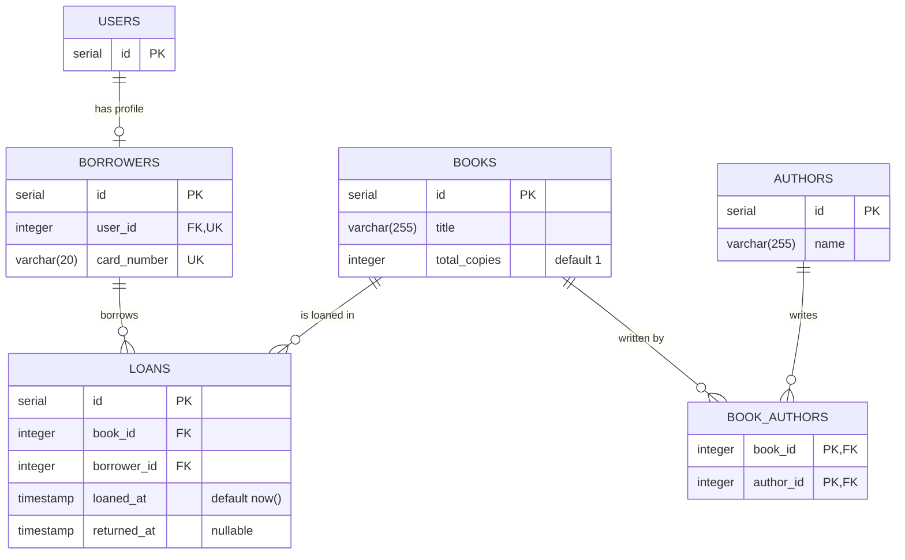

# Kysely Migration Generator

Convert the Mermaid ERD in `docs/architecture/schema.mmd` (produced by the `erd-generator` skill) into one Kysely migration file that builds cleanly and runs against PostgreSQL. All commands run from the **repository root**.

## Workflow

1. **Read inputs.**
   - Read `docs/architecture/schema.mmd`. If it is missing or invalid, stop and tell the user to run the `erd-generator` skill first.
   - Read `src/db/migrations/001_initial_schema.ts` as the style baseline, and list every file in `src/db/migrations/`.
2. **Find tables that already exist.** Search all existing migrations for `.createTable('<name>')`. Any ERD entity whose table is already created (including entities marked `%% existing:`, e.g. `users`) is **skipped**: do not create or drop it. It can still be the target of foreign keys. Read its migration to learn its real PK type. If no entities are new, tell the user there is nothing to migrate and stop.
3. **Order the new tables** so every parent comes before the children that reference it (topological order of the FK graph). Ignore self-references when ordering. If two tables reference each other, create both without the FK and add it afterwards with `db.schema.alterTable(...).addForeignKeyConstraint(...)`.
4. **Write the migration** to `src/db/migrations/<timestamp>_<migration_name>.ts` using the rules below.
5. **Verify** (see "Verification loop").
6. **Report** the file path, the tables in creation order, any skipped existing tables, the assumptions you made, and the results of the verification commands.

## File name

`src/db/migrations/<timestamp>_<migration_name>.ts`

- `<timestamp>` is UTC `YYYYMMDDHHMMSS`, taken from `date -u +%Y%m%d%H%M%S`. Kysely runs migrations in alphabetical filename order, so this sorts after `001_...`.
- `<migration_name>` is `snake_case` and describes the change, e.g. `20261005143000_create_library_schema.ts`.
- Never reuse the `001_` numbering style.

## Required structure

```ts
import { Kysely, sql } from 'kysely';

export async function up(db: Kysely<any>): Promise<void> {
  // one `await db.schema.createTable(...)...execute();` per table, parents first
}

export async function down(db: Kysely<any>): Promise<void> {
  // one `await db.schema.dropTable('<name>').execute();` per table, in REVERSE of up() order
}
```

- Both functions must be exported with exactly these signatures.
- `down` drops **only** the tables this migration created, in exact reverse of the creation order (children before parents). Never drop a skipped existing table such as `users`.
- Only import `sql` if it is used.

## Translation rules

### Entities -> tables

Table name is the entity name in lowercase `snake_case`, keeping the diagram's plurality: `USERS` -> `users`, `BOOK_AUTHORS` -> `book_authors`. Attribute names are used as written (`snake_case`).

### Keys and columns

- **Single PK, `serial`/`integer`:** `.addColumn('id', 'serial', (col) => col.primaryKey())`. A single integer PK always becomes `serial`; a single `bigint` PK becomes `bigserial`.
- **Single PK, `uuid`:** ``.addColumn('id', 'uuid', (col) => col.primaryKey().defaultTo(sql`gen_random_uuid()`))``.
- **Composite PK** (more than one attribute marked `PK`, typical for junction tables): keep the declared column types, no auto-generation, and add `.addPrimaryKeyConstraint('<table>_pkey', ['col_a', 'col_b'])` **after** the `addColumn` calls for those columns (Kysely type-checks the column names against the columns already added).
- **FK:** `.addColumn('book_id', 'integer', (col) => col.references('books.id').onDelete('cascade').notNull())`. Always `.onDelete('cascade')`. The FK column type **must match the referenced PK type**: `serial` -> `'integer'`, `bigserial` -> `'bigint'`, `uuid` -> `'uuid'`. (`users.id` is `serial`, so FKs to it are `'integer'`.)
- **UK:** add `.unique()`.
- **Nullability:** every column is `.notNull()` unless the ERD comment contains `nullable` (PK columns do not need it). A nullable FK omits `.notNull()`.
- **Defaults** come from the comment: `default now()` -> ``.defaultTo(sql`now()`)``; `default 0` -> `.defaultTo(0)`; `default true` -> `.defaultTo(true)`; `default 'x'` -> `.defaultTo('x')`.
- **FK indexes:** for every FK column that is not already unique or the first column of the primary key, add `await db.schema.createIndex('<table>_<column>_idx').on('<table>').column('<column>').execute();` right after that table's `createTable`.

### Type mapping

| Mermaid type | Kysely column type |
| --- | --- |
| `serial` / `bigserial` | `'serial'` / `'bigserial'` |
| `integer`, `int` | `'integer'` |
| `smallint`, `bigint` | `'smallint'`, `'bigint'` |
| `varchar(n)` | `'varchar(n)'` |
| `string`, bare `varchar` | `'varchar(255)'` |
| `text` | `'text'` |
| `boolean`, `bool` | `'boolean'` |
| `date` | `'date'` |
| `timestamp`, `datetime` | `'timestamp'` |
| `timestamptz` | `'timestamptz'` |
| `numeric`, `decimal` | `'numeric(p, s)'` from a comment like `precision 10,2`; default `'numeric(10, 2)'` |
| `float`, `real` | `'real'` |
| `double` | `'double precision'` |
| `uuid` | `'uuid'` |
| `json`, `jsonb` | `'jsonb'` |

### Cardinalities

The left entity is the parent; the right entity is the child that holds the FK column.

- `A ||--o{ B` (one-to-many): FK column on `b` referencing `a.id`, `.notNull()`, `.onDelete('cascade')`, plus the FK index. No unique constraint.
- `A ||--o| B` (one-to-one): FK column on `b` referencing `a.id`, `.notNull()`, `.onDelete('cascade')`, plus **`.unique()`** so each `a` row has at most one `b` row. The unique constraint already serves as the index.
- `A |o--o{ B` or `A |o--o| B` (optional parent): same as above but the FK column is nullable (no `.notNull()`).
- `A }o--o{ B` (many-to-many, if it appears): create a junction table `a_b` with two FK columns and a composite primary key.
- Which attribute is the FK for a relationship: use the child's attributes marked `FK` whose name matches the parent (`book_id` -> `books`). If that is ambiguous, use the relationship line connecting the two entities. The referenced column is always the parent's PK.

## Verification loop

1. Make sure the database is up. If `npm run migrate:up` reports a connection error, tell the user to run `docker compose up -d`; that is not a code problem.
2. Run `npm run build` (this is `tsc --noEmit`). Fix every TypeScript error in the migration.
3. Run `npm run migrate:up`. It must print `migration "<timestamp>_<migration_name>" was executed successfully`.
4. If either command fails, read the error, fix **the new migration file only**, and re-run both. Maximum 3 attempts; then stop and report the last error honestly.
5. Optional reversibility check: `npm run migrate:down` (rolls back only the latest migration), then `npm run migrate:up` again.

## Guardrails

- Never edit, rename, or delete an existing migration (including `001_initial_schema.ts`).
- Never create tables, columns, or constraints that are not in the ERD (apart from the FK indexes above).
- Use the Kysely schema builder (`db.schema...`); use `sql` only for default expressions.
- No `any` other than the required `Kysely<any>`.
- Generate **one** migration file per request.

## Example

Input (`schema.mmd`, abbreviated):



Output (`src/db/migrations/20261005143000_create_library_schema.ts`). `users` is skipped because it already exists:

```ts
import { Kysely, sql } from 'kysely';

export async function up(db: Kysely<any>): Promise<void> {
  await db.schema
    .createTable('borrowers')
    .addColumn('id', 'serial', (col) => col.primaryKey())
    .addColumn('user_id', 'integer', (col) =>
      col.references('users.id').onDelete('cascade').notNull().unique()
    )
    .addColumn('card_number', 'varchar(20)', (col) => col.notNull().unique())
    .execute();

  await db.schema
    .createTable('books')
    .addColumn('id', 'serial', (col) => col.primaryKey())
    .addColumn('title', 'varchar(255)', (col) => col.notNull())
    .addColumn('total_copies', 'integer', (col) => col.notNull().defaultTo(1))
    .execute();

  await db.schema
    .createTable('authors')
    .addColumn('id', 'serial', (col) => col.primaryKey())
    .addColumn('name', 'varchar(255)', (col) => col.notNull())
    .execute();

  await db.schema
    .createTable('book_authors')
    .addColumn('book_id', 'integer', (col) =>
      col.references('books.id').onDelete('cascade').notNull()
    )
    .addColumn('author_id', 'integer', (col) =>
      col.references('authors.id').onDelete('cascade').notNull()
    )
    .addPrimaryKeyConstraint('book_authors_pkey', ['book_id', 'author_id'])
    .execute();
  await db.schema
    .createIndex('book_authors_author_id_idx')
    .on('book_authors')
    .column('author_id')
    .execute();

  await db.schema
    .createTable('loans')
    .addColumn('id', 'serial', (col) => col.primaryKey())
    .addColumn('book_id', 'integer', (col) =>
      col.references('books.id').onDelete('cascade').notNull()
    )
    .addColumn('borrower_id', 'integer', (col) =>
      col.references('borrowers.id').onDelete('cascade').notNull()
    )
    .addColumn('loaned_at', 'timestamp', (col) =>
      col.defaultTo(sql`now()`).notNull()
    )
    .addColumn('returned_at', 'timestamp')
    .execute();
  await db.schema
    .createIndex('loans_book_id_idx')
    .on('loans')
    .column('book_id')
    .execute();
  await db.schema
    .createIndex('loans_borrower_id_idx')
    .on('loans')
    .column('borrower_id')
    .execute();
}

export async function down(db: Kysely<any>): Promise<void> {
  await db.schema.dropTable('loans').execute();
  await db.schema.dropTable('book_authors').execute();
  await db.schema.dropTable('authors').execute();
  await db.schema.dropTable('books').execute();
  await db.schema.dropTable('borrowers').execute();
}
```

Notes on the example: `book_authors.book_id` needs no index because it is the first column of the composite PK; `book_authors.author_id` does. `borrowers.user_id` is unique (one-to-one), so it needs no extra index.
